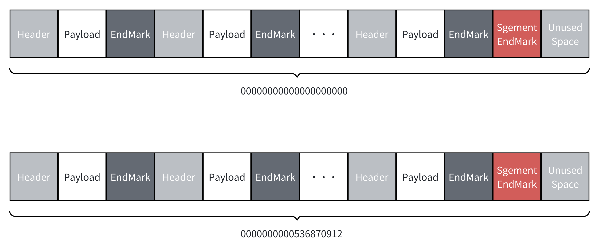

MappedFileQueues
================

[](https://codecov.io/gh/eventhorizon-cli/MappedFileQueues.Stream)
[](https://www.nuget.org/packages/MappedFileQueues.Stream/)

English | [简体中文](./README.zh-CN.md)

**MappedFileQueues.Stream** is a high-performance queue based on Memory-Mapped Files, designed specifically for inter-process communication (IPC).

MappedFileQueues.Stream supports transmitting custom reference-type data. However, note that the serialization and deserialization process can cause some performance loss, so we recommend only using this feature for complex data that truly requires reference type definitions.
If you only need to transmit simple data, consider defining your data as structs and using [https://github.com/eventhorizon-cli/MappedFileQueues](https://github.com/eventhorizon-cli/MappedFileQueues) for even more efficient transport.

### Design Overview

MappedFileQueues persistently store data through memory-mapped files. The overall structure is divided into several Segments, and each Segment contains multiple Messages.

A Message consists of three parts:

- **Header**: Records the length of the Payload; has a fixed size of 4 bytes.
- **Payload**: Stores the actual data content.
- **EndMarker**: Marks the end of the Message; 1 byte in size with a value of 0xFF.



The design of Segments is as follows:

- Each Segment file is named after the offset of the first Message it contains, padded to 20 digits with leading zeros. For example, `0000000000536870912` means this Segment starts at offset 536870912.
- `SegmentSize` specifies the size of each Segment via configuration. When the remaining space at the end isn't enough to hold a complete Message, a Segment End Marker is written and a new Segment is created.
- The Segment End Marker is 1 byte with the value 0xEE, indicating this Segment has finished. This marker and any unused leftover space do **not** count toward the offset.
- Message writes are counted in bytes; for every 1 byte written, the offset increments by 1.
- For example, if the offset is 1024, it means 1024 bytes of data have already been written.

The offset is stored using the long type, with a maximum supported value of 2^63-1.

To keep the design simple, MappedFileQueues does not handle offset overflow issues. Theoretically, the maximum amount of data that can be written is 2^63-1 bytes (about 8 EB). In practical applications, this limit is unlikely to be reached.

If you really need to handle more data than this limit, consider periodically changing the StorePath or using multiple instances of MappedFileQueues to distribute data.

For performance reasons, when there is no data available to consume, the Consumer will spin-wait first. The maximum duration for a single spin-wait can be set through the configuration option ConsumerSpinWaitDuration, which defaults to 100 milliseconds. If the timeout is reached and no data is available, the consumer will enter sleep state. The sleep duration is controlled by ConsumerRetryInterval, which defaults to 1 second.

### Storage Directory

Under the storage path specified by the `StorePath` configuration option, MappedFileQueues will create the following directory structure:

```bash
├── commitlog
│   ├── 000000000000000000000
│   ├── 000000000000000001024
│   └── ...
├── offset
│   ├── producer.offset
│   └── consumer.offset
```

Details:

- The `commitlog` directory stores the actual Segment files.

- The `offset` directory stores the offset files for both the producer and the consumer.

### Usage Example

#### Configuration Options (MappedFileQueueOptions)

- **StorePath**: The storage path, must be a valid folder path.

- **SegmentSize**: The size of each Segment.

- **ConsumerRetryInterval**: The interval for the consumer to retry when there is no data to consume, default is 1 second.

- **ConsumerSpinWaitDuration**: The maximum duration for a single spin-wait for data by the consumer, default is 100 milliseconds.

#### Producing and Consuming Data

Producer and consumer interfaces in MappedFileQueues look as follows:

```csharp
public interface IMappedFileProducer
{
    /// <summary>
    /// The next offset where message will be written in the mapped file queue.
    /// </summary>
    public long NextOffset { get; }

    /// <summary>
    /// Produces a message to the mapped file queue.
    /// </summary>
    /// <param name="buffer">The byte buffer containing the message to produce.</param>
    public void Produce(ReadOnlySpan<byte> buffer);

    /// <summary>
    /// Produces a message to the mapped file queue using the specified serializer.
    /// </summary>
    /// <param name="message">The message to produce.</param>
    /// <param name="serializer">The serializer to use for the message.</param>
    /// <typeparam name="T">The type of the message to produce.</typeparam>
    public void Produce<T>(T message, IMessageSerializer<T> serializer);
}

public interface IMappedFileConsumer
{
    /// <summary>
    /// The next offset to consume from the mapped file queue.
    /// </summary>
    public long NextOffset { get; }

    /// <summary>
    /// Consumes a message from the mapped file queue.
    /// </summary>
    /// <remarks>Do not use the returned span after calling Commit.</remarks>
    /// <returns>A span containing the consumed message.</returns>
    public ReadOnlySpan<byte> Consume();

    /// <summary>
    /// Consumes a message from the mapped file queue and deserializes it using the provided deserializer.
    /// </summary>
    /// <param name="deserializer">The deserializer to use for the message.</param>
    /// <typeparam name="T">The type of the message to deserialize.</typeparam>
    /// <returns>The deserialized message of type T.</returns>
    public T Consume<T>(IMessageDeserializer<T> deserializer);

    /// <summary>
    /// Commits the offset of the last consumed message.
    /// <remarks>Please ensure the message has been processed before calling this method.</remarks>
    /// </summary>
    void Commit();
}
```

Note:
For performance, the Consumer implementation uses `ArrayPool` to reuse memory buffers. Each time a message is consumed, a buffer is obtained from the pool, and it is returned upon `Commit`. This greatly reduces memory allocations and increases performance. **But this also means you must process the returned span before calling `Commit`.** If you use the `T Consume<T>(IMessageDeserializer<T> deserializer)` method, you don't need to worry about this.

**Example:**

Define your data type:

```csharp
public class TestClass
{
    public int IntValue { get; set; }
    public long LongValue { get; set; }
    public double DoubleValue { get; set; }
    public string StringValue { get; set; }
}
```

Define serializers and deserializers using `System.Text.Json`:

```csharp
public class TestMessageSerializer : IMessageSerializer<TestClass>
{
    public ReadOnlySpan<byte> Serialize(TestClass message) => JsonSerializer.SerializeToUtf8Bytes(message);
}

public class TestMessageDeserializer : IMessageDeserializer<TestClass?>
{
    public TestClass? Deserialize(ReadOnlySpan<byte> buffer) => JsonSerializer.Deserialize<TestClass>(buffer);
}
```

Create a MappedFileQueues instance, get the singleton producer and consumer, and produce/consume data:

```csharp
var storePath = "test";

// If you have run the test before, delete the previous data first
if (Directory.Exists(storePath))
{
    Directory.Delete(storePath, true);
}

var serializer = new TestMessageSerializer();
var deserializer = new TestMessageDeserializer();

var queue = MappedFileQueue.Create(new MappedFileQueueOptions
{
    StorePath = storePath, SegmentSize = 512 * 1024 * 1024 // 512 MB
});

var producer = queue.Producer;

var consumer = queue.Consumer;

var produceTask = Task.Run(() =>
{
    for (var i = 1; i <= 100; i++)
    {
        var testData = new TestClass
        {
            IntValue = i, LongValue = i * 10, DoubleValue = i / 2.0, StringValue = "TestString_" + i
        };
        producer.Produce(testData, serializer);
    }

    Console.WriteLine("Produced 100 items.");
});

var consumeTask = Task.Run(() =>
{
    for (var i = 1; i <= 100; i++)
    {
        var testData = consumer.Consume<TestClass>(deserializer);
        Console.WriteLine(
            $"Consumed: IntValue={testData.IntValue}, LongValue={testData.LongValue}, DoubleValue={testData.DoubleValue}, StringValue={testData.StringValue}");
        consumer.Commit();
    }

    Console.WriteLine("Consumed 100 items.");

});

await Task.WhenAll(produceTask, consumeTask);
```
