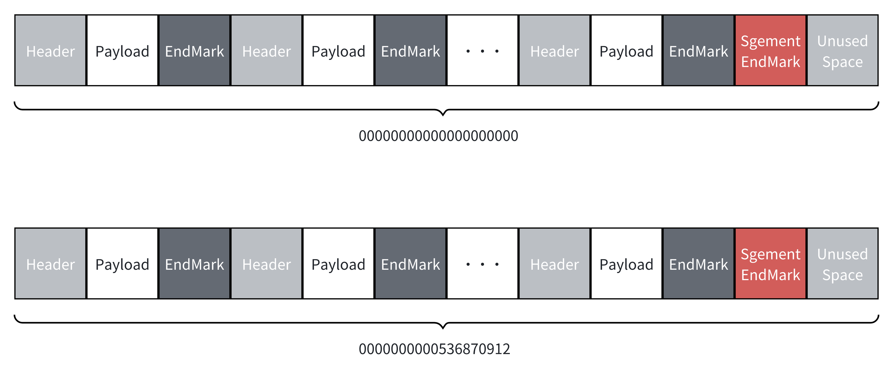

MappedFileQueues
=================

[](https://codecov.io/gh/eventhorizon-cli/MappedFileQueues.Stream)
[](https://www.nuget.org/packages/MappedFileQueues.Stream/)

English | [简体中文](./README.zh-CN.md)

**MappedFileQueues.Stream** 是一个基于内存映射文件（Memory-Mapped Files）的高性能队列，专为进程间通信（IPC）设计。

MappedFileQueues.Stream 支持传递自定义引用类型的数据，但序列化和反序列化的过程会导致性能损失，因此建议仅在需要通过定义引用类型传递复杂数据时使用。如果你只需要传递简单的数据，可以把数据定义为结构体，并使用 [https://github.com/eventhorizon-cli/MappedFileQueues](https://github.com/eventhorizon-cli/MappedFileQueues) 进行更高效的传输。

### 设计概述

MappedFileQueues 通过内存映射文件来持久存储数据，整体结构分为若干个 Segment，每个 Segment 内又包含多个 Message。

Message 由三部分组成：

- **Header**：记录了 Payload 的长度，其本身大小为 4 字节。
- **Payload**：实际存储的数据内容。
- **EndMarker**：用于标识 Message 的结束，大小为 1 字节，内容为 0xFF。



Segment 的设计如下：

- 每个 Segment 的文件名为该段中第一个 Message 的 offset，并以 0 补足到 20 位。例如，`0000000000536870912` 表示该 Segment 从 offset 为 536870912 的位置开始。
- 每个 Segment 的大小由配置项 `SegmentSize` 决定，写入数据时如果末尾剩余的空间不足以容纳一个完整的 Message，会写入一个 Segment 的结束标记，并创建新的 Segment。
- Segment 结束标记的大小为 1 字节，内容为 0xEE，表示该 Segment 已经结束。此结束标志以及剩余的不被利用的空间不会纳入到 offset 的计算中。
- Message 的写入以 byte 为单位计数，每写入 1 byte，offset 加 1。
- 例如，offset 为 1024 时，表示之前已写入了 1024 字节的数据。

offset 使用 long 类型存储，支持的最大值为 2^63-1。

为简化设计，MappedFileQueues 并没有处理 offset 的溢出问题。理论允许写入的最大数据量为 2^63-1 字节（约 8 EB）。在实际应用中，通常不会达到这个极限。

如果确实需要处理比这个极限更大的数据量，可以考虑定期修改 StorePath（存储路径）或使用多个 MappedFileQueues 实例来分散数据。

为保证性能，当没有可消费数据时，Consumer 会先自旋等待，单次自旋等待的最长时间可通过配置项 ConsumerSpinWaitDuration 设置，默认值为 100 毫秒。若超时仍无数据，消费者将进入休眠状态，休眠时长由 ConsumerRetryInterval 控制，默认值为 1 秒。

### 存储目录

通过 `StorePath` 配置项指定的存储路径下，MappedFileQueues 会创建以下目录结构：

```bash
├── commitlog
│   ├── 000000000000000000000
│   ├── 000000000000000001024
│   └── ...
├── offset
│   ├── producer.offset
│   └── consumer.offset
```

其中：

- `commitlog` 目录存储实际的 Segment 文件。

- `offset` 目录存储生产者和消费者的偏移量文件。

### 使用示例

#### 配置选项（MappedFileQueueOptions）

- **StorePath**：存储路径，必须是一个有效的文件夹路径。

- **SegmentSize**：每个 Segment 的大小。

- **ConsumerRetryInterval**：消费者在没有数据可消费时的重试间隔，默认为 1 秒。

- **ConsumerSpinWaitDuration**：消费者单次自旋等待数据时的最大等待时间，默认为 100 毫秒。

#### 生产和消费数据

MappedFileQueues 中的生产者和消费者接口如下所示：

```csharp
public interface IMappedFileProducer
{
    /// <summary>
    /// 下一个消息将被写入的偏移量。
    /// </summary>
    public long NextOffset { get; }

    /// <summary>
    /// 将消息写入到内存映射文件队列。
    /// </summary>
    /// <param name="buffer">包含要写入的消息的字节缓冲区。</param>
    public void Produce(ReadOnlySpan<byte> buffer);

    /// <summary>
    /// Produces a message to the mapped file queue using the specified serializer.
    /// 使用指定的序列化器将消息写入到内存映射文件队列。
    /// </summary>
    /// </summary>
    /// <param name="message">待写入的消息。</param>
    /// <param name="serializer">用于序列化消息的序列化器。</param>
    /// <typeparam name="T">消息的类型。</typeparam>
    public void Produce<T>(T message, IMessageSerializer<T> serializer);
}

public interface IMappedFileConsumer
{
    /// <summary>
    /// 下一个将被消费的消息的偏移量。
    /// </summary>
    public long NextOffset { get; }

    /// <summary>
    /// 从内存映射文件队列中消费一条消息。
    /// </summary>
    /// <remarks>请注意，在调用 Commit 后不要使用返回的 span。</remarks>
    /// <returns>包含了消费的消息的 span。</returns>
    public ReadOnlySpan<byte> Consume();

    /// <summary>
    /// 使用提供的反序列化器从内存映射文件队列中消费一条消息并进行反序列化。
    /// </summary>
    /// <param name="deserializer">用于反序列化消息的反序列化器。</param>
    /// <typeparam name="T">消息的类型。</typeparam>
    /// <returns>反序列化后的消息对象。</returns>
    public T Consume<T>(IMessageDeserializer<T> deserializer);

    /// <summary>
    /// 提交当前消费的 offset。
    /// <remarks>在调用此方法之前，请确保已经消费了消息。</remarks>
    /// </summary>
    void Commit();
}
```

需要注意的是，在 Consumer 的实现中，为了优化性能，使用了 ArrayPool 来复用内存缓冲区。每次消费消息时，都会从 ArrayPool 中获取一个缓冲区，并在 Commit 后将其归还。这样可以减少内存分配的开销，提高性能。但这也意味必须在调用 Commit 之前处理掉返回的 span。如果使用的是 `T Consume<T>(IMessageDeserializer<T> deserializer)` 方法，则不需要考虑这点。

以下是一个简单的使用示例：

定义数据类型：

```csharp
public class TestClass
{
    public int IntValue { get; set; }
    public long LongValue { get; set; }
    public double DoubleValue { get; set; }
    public string StringValue { get; set; }
}
```

使用 `System.Text.Json` 定义序列化器和反序列化器：

```csharp
public class TestMessageSerializer : IMessageSerializer<TestClass>
{
    public ReadOnlySpan<byte> Serialize(TestClass message) => JsonSerializer.SerializeToUtf8Bytes(message);
}

public class TestMessageDeserializer : IMessageDeserializer<TestClass?>
{
    public TestClass? Deserialize(ReadOnlySpan<byte> buffer) => JsonSerializer.Deserialize<TestClass>(buffer);
}
```

创建 MappedFileQueues 实例获取单例的生产者和消费者，并进行数据的生产和消费：

```csharp
var storePath = "test";

// If you have run the test before, delete the previous data first
if (Directory.Exists(storePath))
{
    Directory.Delete(storePath, true);
}

var serializer = new TestMessageSerializer();
var deserializer = new TestMessageDeserializer();

var queue = MappedFileQueue.Create(new MappedFileQueueOptions
{
    StorePath = storePath, SegmentSize = 512 * 1024 * 1024 // 512 MB
});

var producer = queue.Producer;

var consumer = queue.Consumer;

var produceTask = Task.Run(() =>
{
    for (var i = 1; i <= 100; i++)
    {
        var testData = new TestClass
        {
            IntValue = i, LongValue = i * 10, DoubleValue = i / 2.0, StringValue = "TestString_" + i
        };
        producer.Produce(testData, serializer);
    }

    Console.WriteLine("Produced 100 items.");
});

var consumeTask = Task.Run(() =>
{
    for (var i = 1; i <= 100; i++)
    {
        var testData = consumer.Consume<TestClass>(deserializer);
        Console.WriteLine(
            $"Consumed: IntValue={testData.IntValue}, LongValue={testData.LongValue}, DoubleValue={testData.DoubleValue}, StringValue={testData.StringValue}");
        consumer.Commit();
    }

    Console.WriteLine("Consumed 100 items.");

});

await Task.WhenAll(produceTask, consumeTask);
```
